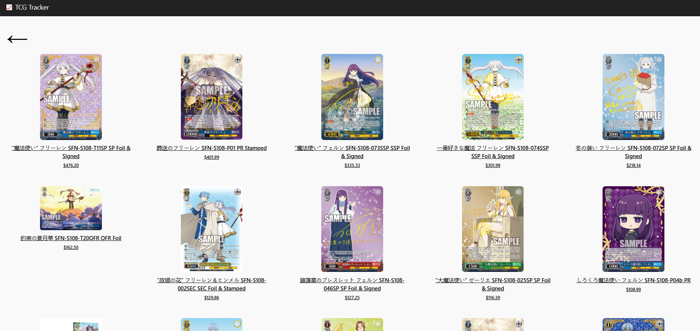
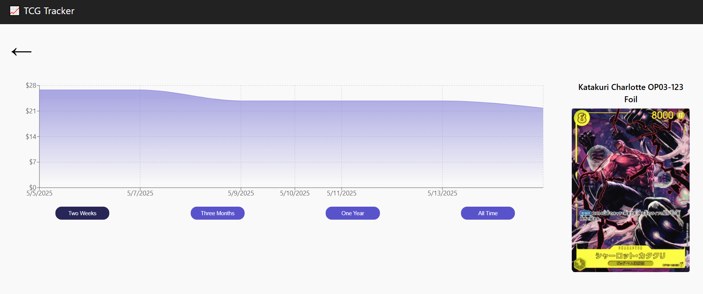

# TCG Price Tracker – Frontend

Live Site: [tcg-tracker.netlify.app](https://tcg-tracker.netlify.app)

This is the frontend of the TCG Price Tracker web app. It displays daily-updated trading card prices from multiple TCGs and visualizes the price history of individual cards using interactive charts. Data is retrieved from a custom AWS-powered backend that continuously scrapes and stores card pricing information.

---

## Features

- 📈 View historical price trends for individual cards
- 🔁 Select time ranges: Last 2 Weeks, 3 Months, 1 Year, or All Time
- 📦 Browse all cards within a TCG set
- 🃏 Supports multiple popular TCGs
- 📊 Interactive charts rendered with Recharts
- ⚡ Optimized performance with:
  - React Query API caching (preserved across site navigation)
  - CloudFront CDN image delivery for faster loading

---

## Performance & Optimization

This project emphasizes production-ready practices for speed and efficiency:

- 🧠 **React Query** caches API results for 30 minutes, allowing seamless navigation without re-fetching data.
- 🌎 **AWS CloudFront** is used to deliver card images via CDN, significantly improving image load speed and reducing direct S3 access.

---

## Tech Stack

- **React** (Vite)
- **React Router** – Routing between pages
- **Recharts** – Charting library for price visualization
- **React Query** – Caches API responses for 30 minutes, reducing load times and improving UX
- **AWS CloudFront** – Serves card images via CDN to offload traffic from S3 and lower latency
- **CSS** – Modular styling
- **fetch API** – Used for calling AWS API Gateway endpoints

---

## Screenshots

### Set Page – View all cards in a set

### Card Page – Price history of a single card

---

## Backend

This frontend relies on a separate backend that scrapes and serves TCG card pricing data.  
You can find the backend source code and architecture documentation here:  
➡️ [tcg-tracker-aws](https://github.com/snoh1654/tcg-tracker-aws)

---

## Author

**Sean Noh**  
GitHub: [@snoh1654](https://github.com/snoh1654)
